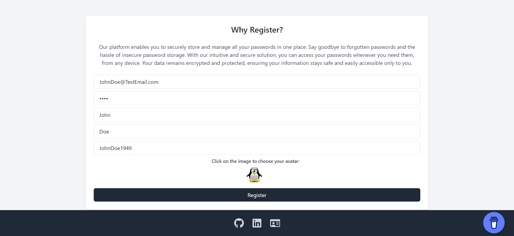
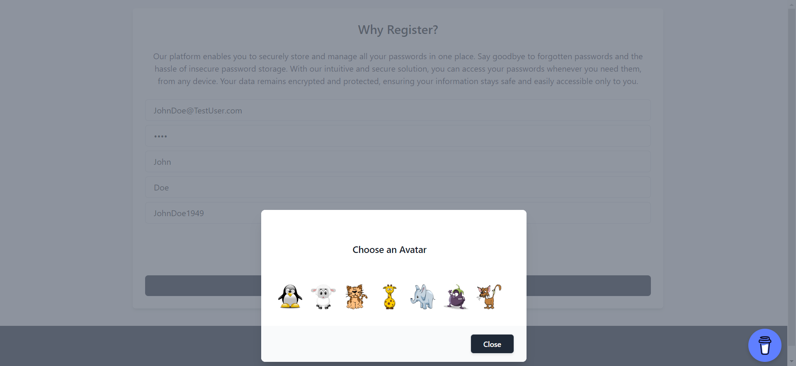
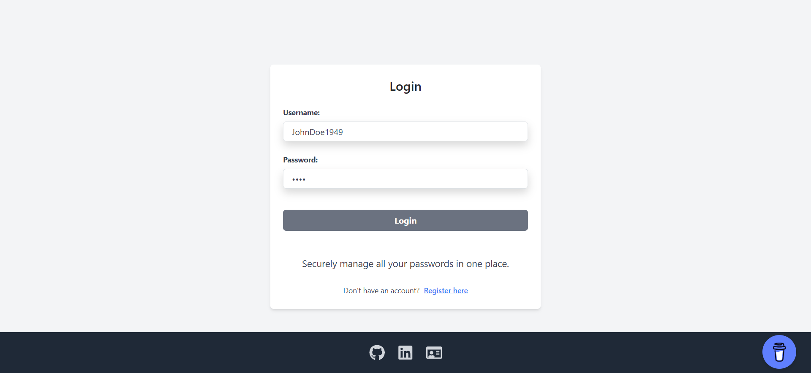
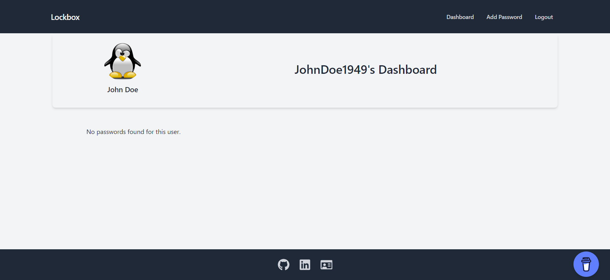
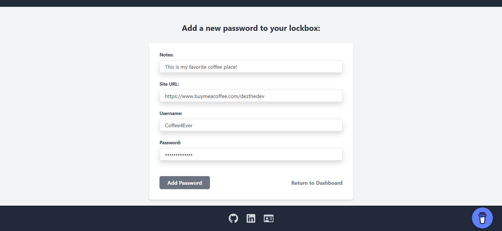
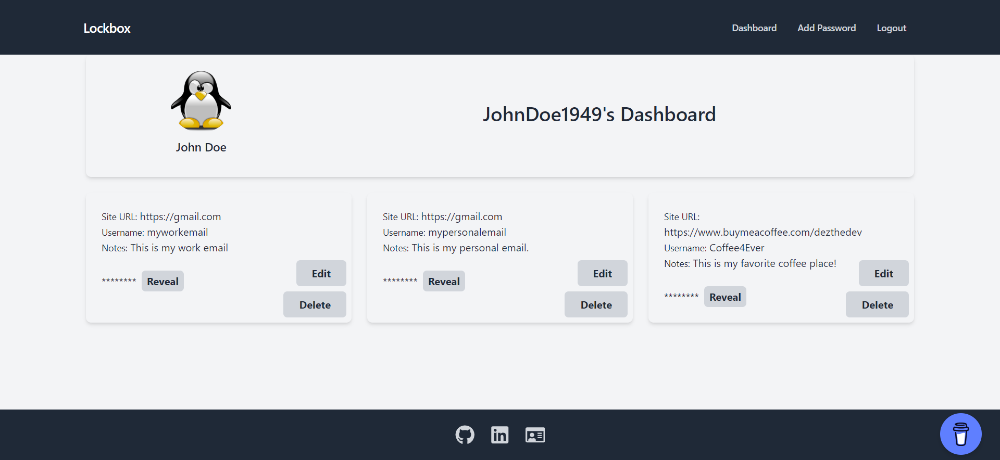
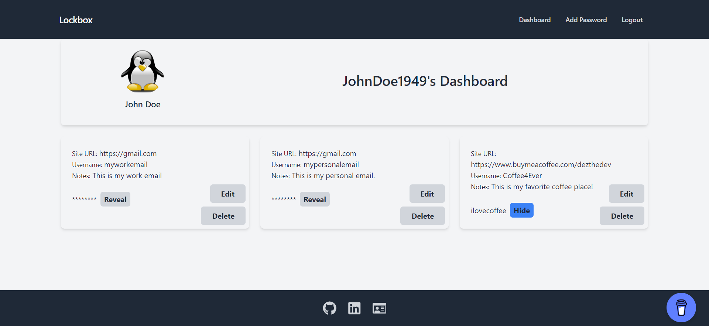

# Lockbox Password Manager

Lockbox is a secure password manager application that enables users to store and manage their passwords with ease and security.

## Description

Lockbox Password Manager is a web-based application that offers users a secure platform to store and manage their passwords. It provides a user-friendly interface and robust security measures to ensure the confidentiality and protection of user data. The application allows users to create an account, securely store passwords, retrieve them when needed, and manage their password data effectively.

## Live Site

Check out the [Live Site](https://lockbox-client.vercel.app/)! 

## Server Architecture

The server is built using the following technologies:

- Node.js
- Express.js
- PostgreSQL
- bcrypt
- cors
- jwt

The server architecture includes various components such as routes, controllers, models, and middleware, ensuring smooth request handling and database management. 

## Features

- User authentication and authorization
- Secure password storage
- User-friendly interface
- Secure routes for sensitive operations
- Real-time data synchronization
- Mobile Responsive Design

## Tech Stack

### Server-Side

- Node.js
- Express.js
- PostgreSQL
- bcrypt
- cors
- jsonwebtoken
- pg-promise

### Client-Side

- React
- React Router
- Stripe
- Tailwind
- Bootstrap
- React Icons
- Vite

## API Reference

The application features various endpoints for different operations, including user authentication, password storage, and data retrieval. Some of the key endpoints include:

### Retrieve Basic Information

```http
GET /
```

### Ensure Protection of Sensitive Data

```http
GET /api/protected
```

| Parameter | Type     | Description                |
| :-------- | :------- | :------------------------- |
| `Authorization` | `string` | **Required**. Bearer token for authentication |


### User Login and Token Generation

```http
POST /api/login
```

| Parameter | Type     | Description                |
| :-------- | :------- | :------------------------- |
| `username` | `string` | **Required**. User's username |
| `pw` | `string` | **Required**. User's password |

### Get User Information

```http
GET /users/:id
```

| Parameter | Type     | Description                |
| :-------- | :------- | :------------------------- |
| `id` | `string` | **Required**. User ID |

### Get User's Stored Passwords

```http
GET /users/:id/passwords
```

| Parameter | Type     | Description                |
| :-------- | :------- | :------------------------- |
| `id` | `string` | **Required**. User ID |

### Add New Password

```http
POST /users/:id/passwords
```

| Parameter | Type     | Description                |
| :-------- | :------- | :------------------------- |
| `id` | `string` | **Required**. User ID |
| `notes` | `string` | Additional notes for the password |
| `site_url` | `string` | URL of the associated site |
| `pw` | `string` | New password |
| `username` | `string` | Username associated with the password |

### Update Existing Password

```http
PUT /users/:id/passwords/:passwordId
```

| Parameter | Type     | Description                |
| :-------- | :------- | :------------------------- |
| `id` | `string` | **Required**. User ID |
| `passwordId` | `string` | **Required**. Password ID to update |
| `notes` | `string` | Updated notes for the password |
| `site_url` | `string` | Updated URL of the associated site |
| `pw` | `string` | Updated password |
| `username` | `string` | Updated username associated with the password |

### Delete Stored Password

```http
DELETE /users/:id/passwords/:passwordId
```

| Parameter | Type     | Description                |
| :-------- | :------- | :------------------------- |
| `id` | `string` | **Required**. User ID |
| `passwordId` | `string` | **Required**. Password ID to delete |

### User Registration and Account Creation

```http
POST /signup
```

| Parameter | Type     | Description                |
| :-------- | :------- | :------------------------- |
| `id` | `string` | **Required**. User ID |
| `email` | `string` | **Required**. User's email |
| `pw` | `string` | **Required**. User's password |
| `first_name` | `string` | **Required**. User's first name |
| `last_name` | `string` | **Required**. User's last name |
| `username` | `string` | **Required**. User's username |
| `avatar` | `string` | **Required**. URL of user's avatar |

### User Logout

```http
GET /logout
```

| Parameter | Type     | Description                |
| :-------- | :------- | :------------------------- |
| `Authorization` | `string` | **Required**. Bearer token for authentication |


## Lessons Learned

During the development of this application, I had the opportunity to delve into several technologies and tools, significantly expanding my skill set. The highlights of my learning journey include:

### Front-end Design and Styling
- Leveraged Tailwind for efficient and streamlined front-end development, enabling the creation of a sleek and user-friendly interface.
- Implemented responsive design principles to ensure seamless usability across various devices, solidifying my grasp of mobile responsiveness.

### Security and Authentication
- Successfully integrated JWT (JSON Web Tokens) for robust authentication, gaining valuable insights into token-based security mechanisms and enhancing my understanding of secure routing.
- Utilized bcrypt for secure password hashing, ensuring robust protection for user credentials and reinforcing my knowledge of best practices in user authentication.

### Back-end Development
- Solidified knowledge of Node.js and Express.js basics, sharpening my proficiency in creating powerful and scalable applications.
- Addressed cross-origin resource sharing concerns by employing Cors, effectively handling potential security vulnerabilities associated with unauthorized origins.

### State Management
- Delved into the implementation of useContext, enriching my comprehension of state management within the application and facilitating streamlined data flow between components.

### Database Management
- Managed a PostgreSQL database on ElephantSQL, establishing a solid foundation in database management and data storage techniques.
- Established table relationships using foreign keys, refining my skills in database structuring and enhancing data integrity within the application.

My experience with implementing these technologies has not only led to the development of a functional password manager but has also strengthened my abilities as a developer. I take immense pride in the outcome of this project and look forward to applying these newfound skills to future endeavors.

## Screenshots

 ..



 



